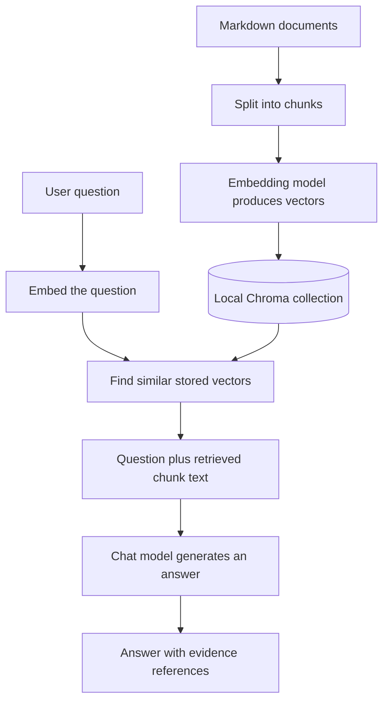

# Start here: reading and running your first RAG system

You do not need to understand all seven labs at once. Start with one document,
one question, and the basic pipeline. Then change one retrieval step at a time.

Prefer a daily schedule? Use the [14-day checklist](DAILY_PLAN.md) alongside this guide.

## What the tools do in this repository

| Tool or concept | Its job here |
|---|---|
| Python | Runs the application logic and joins the components together. |
| `uv` | Installs the locked dependencies and runs commands in the project environment. |
| LangChain | Supplies document, message, model-client, and retrieval interfaces. |
| LangGraph | Controls which Python function runs next and passes state between functions. |
| Azure Foundry deployments | Host the chat model and embedding model accessed by this repo's Azure OpenAI clients. |
| Chroma | Stores document vectors, text, and metadata locally and searches them. |
| RAG | Retrieves relevant text, adds it to a prompt, and asks a model to answer from it. |

RAG does not retrain the chat model. It supplies relevant material at the time of a
question. A plausible answer is not proof of correctness: inspect its evidence.

## The two paths to understand first



The top path is **ingestion**, usually done once per corpus/configuration. The bottom
path runs for each question. A chunk is a small passage, an embedding is a list of
numbers representing text, and dimensions is the number of values in that list.
`top_k=4` means retrieve up to four chunks, not necessarily four different documents.

## Your first run

From the repository root, follow the [setup instructions](../README.md#quickstart).
Edit `.env` locally to use your Azure endpoint, API key, and deployment names.
Do not put credentials in source code. Then run:

```bash
uv run rag-lab ingest --lab basic-rag
uv run rag-lab ask --lab basic-rag "What does ORD-4097 mean?"
```

Open [the source document](../data/documents/03_orders.md) first. In the command's
JSON output, compare `answer` with `evidence[].content`. Verify each citation's
document/chunk IDs against evidence. `latency_ms` is elapsed time in milliseconds;
`usage` contains the available chat token counts. A token is a model's unit of text,
often part of a word; this repo's chunk sizes are measured in characters instead.

The first question may build the index if you skipped ingestion. Repeated questions
reuse document vectors, but still call Azure to embed the question and generate an answer.

## Follow the code in this order

1. [BasicRag.ask](../src/rag_lab/labs/basic_rag/pipeline.py): retrieve, generate, return a result.
2. [Generation helpers](../src/rag_lab/shared/generation.py): see the exact prompt and model call.
3. [Result types](../src/rag_lab/shared/types.py): understand the returned evidence and measurements.
4. [CLI factories](../src/rag_lab/cli.py): see how clients, chunks, and lab instances are created.
5. [Document ingestion](../src/rag_lab/shared/documents.py) and [storage](../src/rag_lab/shared/store.py): understand what is indexed and when it is reused.
6. [Evaluation](../src/rag_lab/shared/evaluation.py): learn what a retrieval score does and does not prove.
7. Read the [individual lab guides](../README.md#implemented-labs), then their adjacent Python files.

Docstrings are the triple-quoted explanations at the start of a module, class, or
function. Your editor can show them when you hover over a symbol. `#` comments
explain choices or unfamiliar syntax at the line where you need them.

## Python syntax you will encounter

| Syntax | Meaning in this repo |
|---|---|
| `def ask(question: str) -> RagResult` | A function with input/return type hints; hints usually do not validate values at runtime. |
| `class BasicRag` / `self` | A class groups data and behavior; `self` refers to one constructed instance. |
| `__init__` | Runs when an instance is constructed, such as `BasicRag(store, chat)`. |
| `Any` | The type is intentionally flexible, often so tests can supply fake clients. |
| `int \| None` | Either an integer or no supplied value. |
| `list[Document]` | A list whose elements are LangChain Documents. |
| `document, score = pair` | Unpack two values from a tuple. `_` often marks a deliberately unused value. |
| `[doc for doc, _ in pairs]` | Build a list by looping over document/score pairs. |
| `mapping.get("usage", {})` | Return the value if present; otherwise use an empty dictionary. |
| `@dataclass` | Generate common container methods, including a constructor. |
| `@app.command()` | Register the following function as a terminal command. |
| `lambda item: item[1]` | A short function returning the second element, used as a sorting key. |
| `**item` | Expand a dictionary into named arguments, or merge it into another dictionary. |
| `*items` | Unpack a sequence; in a function signature, collect positional arguments. |
| `from __future__ import annotations` | Postpone evaluation of annotations; it does not execute the types as validation. |
| `try` / `except` / `finally` | Run work, handle an expected error, and run cleanup/timing even on failure. |

## How a LangGraph node works

Think of state as a dictionary passed through a series of functions. A node reads
the keys it needs and returns the keys it updates. In these labs, each returned
key replaces that key's existing value; other state keys remain available.

For a conversational follow-up, the changes look like this:

```text
Input:    question="How long does it last?", history=[previous turns]
rewrite:  adds standalone_question="How long does an inventory reservation last?"
retrieve: adds documents=[matching chunks]
answer:   adds answer="20 minutes ...", updates usage
```

`StateGraph` builds this workflow, `add_node` registers a function, `add_edge`
connects steps, `compile` creates an executable graph, and `invoke` runs it.
`START` and `END` mark its boundaries. Corrective RAG adds a conditional edge:
the grader result selects answer, rewrite, or abstain. Its counter permits two
retrieval attempts total; invalid grader JSON never counts as approval.

`TypedDict` documents expected state keys for type checking. Pydantic's
`EvidenceGrade` performs actual runtime validation of the grader's JSON.

## Try a real conversation in one process

The one-shot CLI does not keep history across shell commands. The following
complete example uses the existing internal factory for this learning exercise.
Run from the repo root after configuring `.env`:

```bash
uv run python - <<'PY'
from rag_lab.cli import _pipeline
from rag_lab.shared.config import get_settings

rag = _pipeline(get_settings(), "conversational-rag", dimensions=None, rebuild=False)
print(rag.ask("Tell me about an inventory reservation.", session_id="practice").answer)
result = rag.ask("How long does it last?", session_id="practice")
print(result.trace["standalone_question"])
print(result.answer)
PY
```

The leading underscore on `_pipeline` marks an internal helper, not a stable public
API. The class itself is small enough to construct directly once you understand
the shared setup code.

## Learn without making Azure calls

```bash
uv sync --extra dev
uv run pytest tests/test_graphs.py -v
uv run pytest tests/test_review_regressions.py -v
```

[Test fakes](../tests/fakes.py) imitate the shape of real clients. Their embeddings
are deterministic hash-derived vectors, not meaningful semantic embeddings; their
answers are scripted. These tests verify code behavior, not real model quality.
Live tests explicitly require `RUN_LIVE_TESTS=1` and configured Azure access.

## Safe first experiments

Change `RAG_TOP_K` from 4 to 1 and rerun a multi-document question. Compare the
evidence before judging the answer. Then try hybrid search on an exact error code.
Only after understanding that difference, explore the dimensions benchmark and graphs.

Changing chunk size/overlap changes the indexed representation: rerun ingestion
with `--rebuild` for the affected lab. Changing top-k does not require rebuilding.
If you see “configuration mismatch,” the old index was created with different
inputs; this is the compatibility check working. An Azure error is separate from
the retrieval pattern—start by checking the configured endpoint and deployment names.
