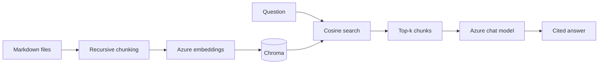
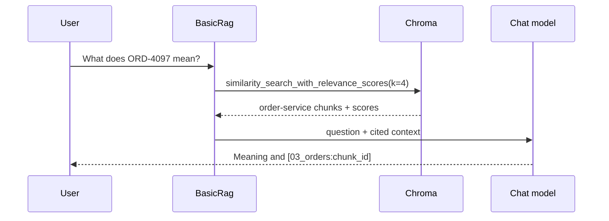

# Lab 1 — Basic RAG

For Python syntax and the shared setup, read [Start Here](../../../../docs/START_HERE.md).
The adjacent Python implementation includes docstrings and inline comments explaining the steps.

Use this baseline when one semantic search is sufficient and predictable latency matters. It makes
the most important RAG choices—chunking, top-k, evidence, and prompting—easy to inspect.





## Run it

```bash
uv run rag-lab ingest --lab basic-rag
uv run rag-lab ask --lab basic-rag "What does ORD-4097 mean?"
uv run rag-lab evaluate --lab basic-rag --output artifacts/basic-rag.json
```

The entry point is `pipeline.py`. `RAG_CHUNK_SIZE`, `RAG_CHUNK_OVERLAP`, and `RAG_TOP_K` control the
experiment. A result includes the answer, evidence with scores, end-to-end latency, model-reported
usage, and trace data.

Worked trace: the query embeds once, cosine search should rank `03_orders`, and the generator sees
only the top chunks. It should say that the same idempotency key was paired with a different body
and cite the retrieved chunk. If that chunk is absent, generation cannot repair retrieval.

Failure modes include boundary-split facts, irrelevant top-k chunks, semantic confusion around
codes, and confident answers from weak evidence. Larger chunks add context but dilute similarity;
larger top-k improves recall but increases tokens and distraction.

## Exercises

1. Tune: compare 350/50, 700/100, and 1200/150 chunk settings on the same questions.
2. Break: set top-k to one and find a multi-document question that loses required evidence.
3. Extend: add a minimum relevance threshold and make insufficient retrieval abstain.
