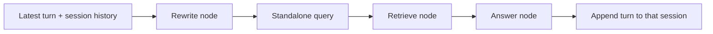
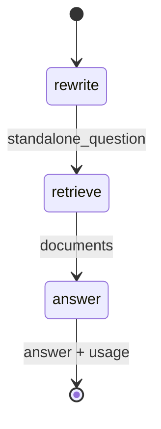

# Lab 6 — Conversational RAG with LangGraph

For Python syntax and the shared setup, read [Start Here](../../../../docs/START_HERE.md).
The adjacent Python implementation includes docstrings and inline comments explaining the steps.

Follow-up questions often contain references such as “it” or “that incident.” This graph rewrites
the latest turn into a standalone retrieval query using only the selected session's history, then
retrieves and answers. Use it for multi-turn assistants where retrieval must remain inspectable.





## Run it

The CLI is intentionally one-shot, so use the Python object for a genuine multi-turn process:

```python
rag.ask("Tell me about an inventory reservation.", session_id="alice")
result = rag.ask("How long does it last?", session_id="alice")
print(result.trace["standalone_question"])
```

The worked second turn should rewrite to a query about inventory-reservation duration, retrieve
`05_inventory`, and answer 20 minutes. Another session has no access to Alice's history.
The answer node uses the resolved standalone question as well as retrieved evidence, so references
remain resolved through generation. Reported usage includes both rewriting and generation for the
current turn, without accumulating previous turns' usage.

Failure modes include history poisoning, a rewrite that silently changes intent, unbounded context,
and session leakage. Rewriting costs an LLM call on follow-ups but lets retrieval operate on an
explicit, debuggable query. `clear(session_id)` removes a local session.

## Exercises

1. Tune: retain only the last one, three, or five turns and compare ambiguous follow-ups.
2. Break: create two sessions with different meanings for “it” and test isolation.
3. Extend: summarize older turns while retaining exact service names and error codes verbatim.
