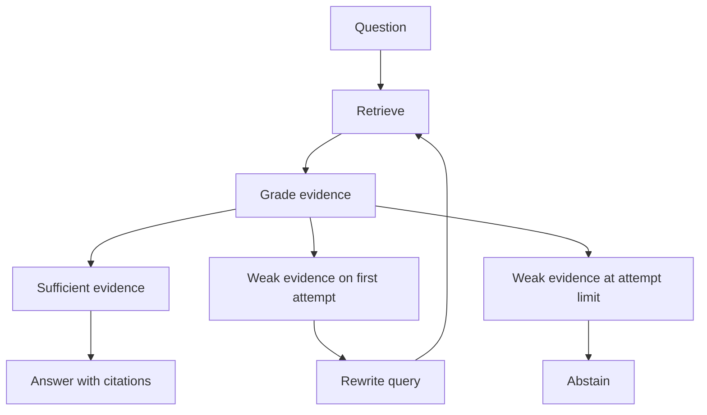
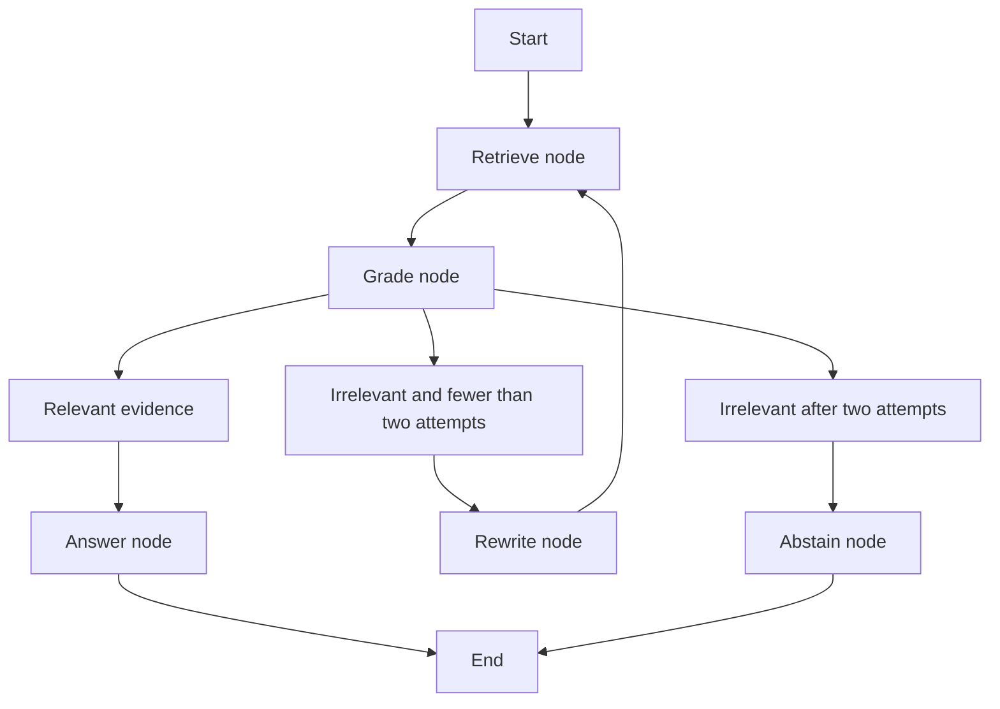

# Lab 7 — Corrective RAG with LangGraph

For Python syntax and the shared setup, read [Start Here](../../../../docs/START_HERE.md).
The adjacent Python implementation includes docstrings and inline comments explaining the steps.

Corrective RAG evaluates retrieved evidence before answering. When evidence is weak, this graph
rewrites the search once and retrieves again. It then answers from sufficient context or explicitly
abstains. Use it when an extra validation call is justified by the cost of unsupported answers.





## Run it

```bash
uv run rag-lab ingest --lab corrective-rag
uv run rag-lab ask --lab corrective-rag "What is the office Wi-Fi password?"
uv run rag-lab evaluate --lab corrective-rag --output artifacts/corrective.json
```

For the worked unsupported question, the first grade should be false, one rewrite should trigger a
second retrieval, and the final result should say there is not enough information. `trace.attempts`
must never exceed two. For supported questions, a correct first grade routes directly to generation.

Failure modes include a permissive grader approving irrelevant text, a strict grader suppressing a
valid answer, rewrite drift, and doubled retrieval latency. The hard attempt bound makes cost and
termination predictable. A strict schema accepts only JSON with a boolean `relevant` field.
Strings such as `"false"`, numbers, extra fields, and malformed responses fail closed as insufficient
evidence. Usage includes all grading, rewriting, and generation calls, even when the graph abstains.
Provider-supported structured output and grader confidence are useful further extensions.

## Exercises

1. Tune: alter the grading rubric and compare false accepts against false rejects.
2. Break: make the rewrite drift from an exact error code and inspect both retrieval attempts.
3. Extend: add a second retrieval source on correction, while preserving the two-attempt bound.
