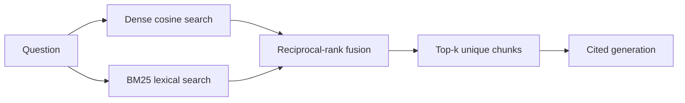
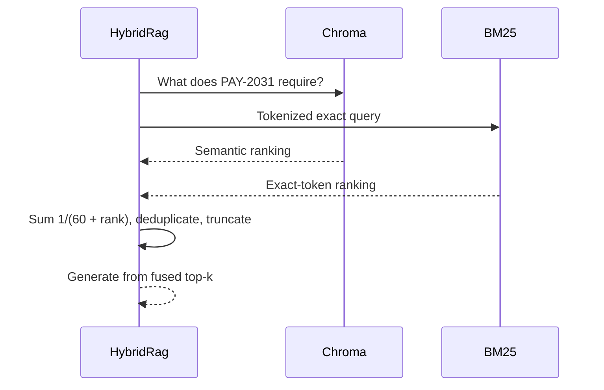

# Lab 3 — Hybrid Search

For Python syntax and the shared setup, read [Start Here](../../../../docs/START_HERE.md).
The adjacent Python implementation includes docstrings and inline comments explaining the steps.

Dense retrieval understands meaning; BM25 rewards exact terms. Hybrid search is useful when the
corpus mixes natural-language concepts with identifiers such as `PAY-2031`, header names, and API
paths. Reciprocal-rank fusion (RRF) combines ranks without trying to normalize incompatible scores.





## Run it

```bash
uv run rag-lab ingest --lab hybrid-search
uv run rag-lab ask --lab hybrid-search "What does PAY-2031 require?"
uv run rag-lab evaluate --lab hybrid-search --output artifacts/hybrid.json
```

`pipeline.py` builds BM25 over the same chunks stored in Chroma, retrieves twice the final top-k
from each source, and fuses them. The worked query should receive a strong lexical rank for
`04_payments` while dense retrieval captures wording around safe payment retries.

Failure modes include poor tokenization, repeated boilerplate dominating BM25, a weak retriever
entering too many candidates, and RRF's rank-only view discarding score confidence. Hybrid search
adds local CPU and memory but no extra LLM call.

## Exercises

1. Tune: change the RRF constant and candidate pool, then compare exact and semantic questions.
2. Break: remove punctuation-aware tokens and observe retrieval for error codes and API paths.
3. Extend: weight dense and lexical RRF contributions independently and justify the weights.
