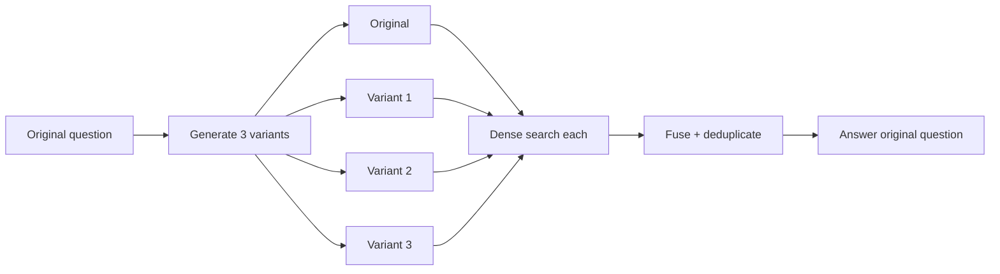
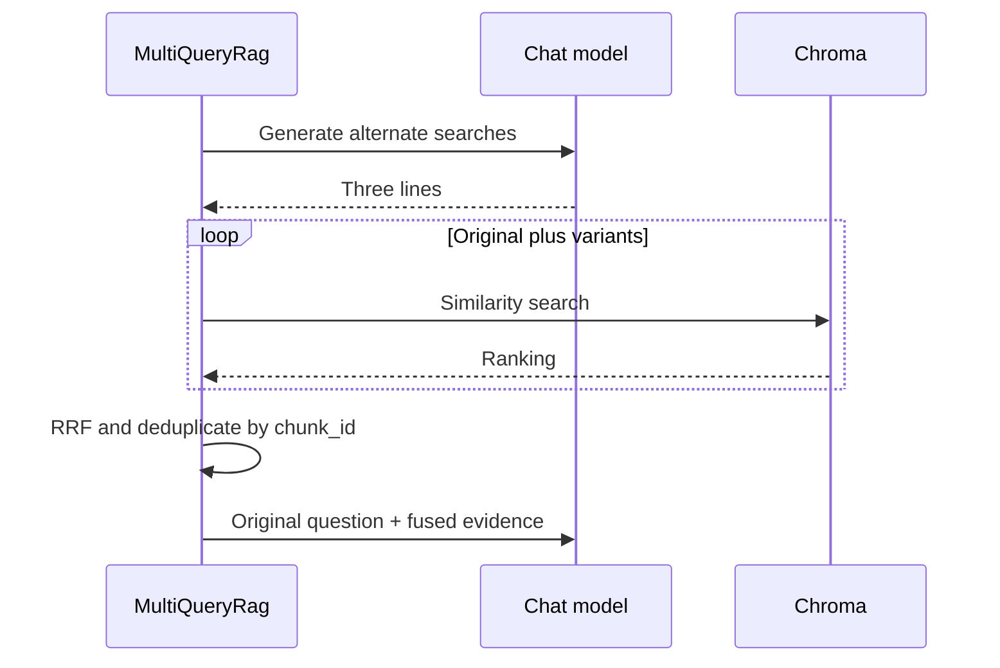

# Lab 5 — Multi-query RAG

For Python syntax and the shared setup, read [Start Here](../../../../docs/START_HERE.md).
The adjacent Python implementation includes docstrings and inline comments explaining the steps.

One user phrase may not align with corpus language. Multi-query RAG asks the chat model for alternate
search formulations, retrieves each one, then fuses and deduplicates the rankings. Use it when recall
is more valuable than the latency and token cost of query expansion.





## Run it

```bash
uv run rag-lab ingest --lab multi-query
uv run rag-lab ask --lab multi-query "How can I trace a failing request across services?"
uv run rag-lab evaluate --lab multi-query --output artifacts/multi-query.json
```

The original question always remains one of the searches. For the worked query, variants may mention
correlation IDs, distributed tracing, or structured logs and retrieve `01_gateway`,
`11_observability`, and `20_oncall`. The final generator answers the original wording.

Failure modes include query drift, lost identifiers, redundant variants, larger candidate sets, and
an extra LLM call. Inspect `trace.queries`; improved recall without faithful variants is accidental.

## Exercises

1. Tune: compare one, three, and five variants and plot recall against latency and token usage.
2. Break: prompt the expander to omit identifiers and test `ORD-4097`.
3. Extend: reject variants whose embedding is too dissimilar from the original question.
