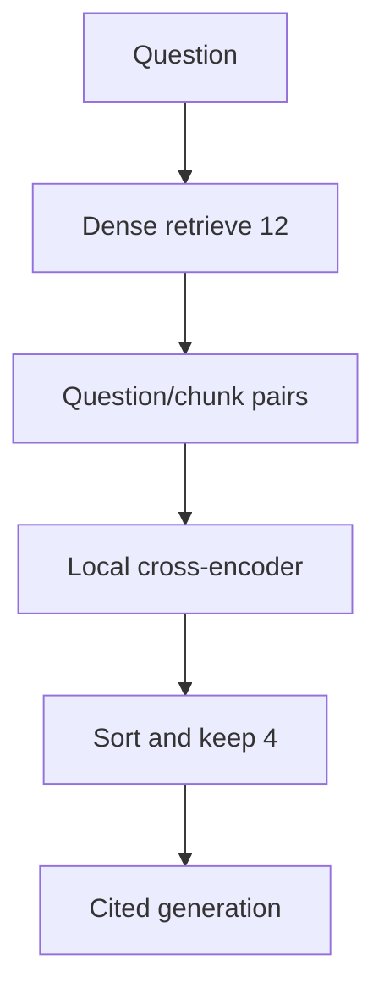
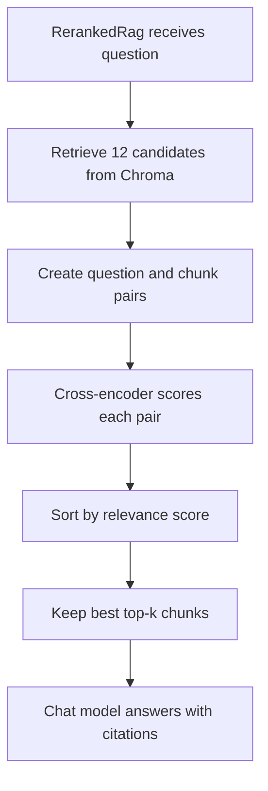

# Lab 4 — Reranking

For Python syntax and the shared setup, read [Start Here](../../../../docs/START_HERE.md).
The adjacent Python implementation includes docstrings and inline comments explaining the steps.

Bi-encoder retrieval is fast because documents are indexed ahead of time. A cross-encoder jointly
reads each question-candidate pair and can order a small candidate set more precisely. Use this when
first-stage recall is adequate but the best evidence often appears too low.





## Run it

```bash
uv sync --extra reranker
uv run rag-lab ingest --lab reranking
uv run rag-lab ask --lab reranking "How should a cache failure affect writes?"
uv run rag-lab evaluate --lab reranking --output artifacts/reranking.json
```

The default `cross-encoder/ms-marco-MiniLM-L-6-v2` model downloads on first use and then runs
locally. `candidate_k=12` and final `top_k` are independent. In the worked query, first-stage search
must include `19_caching`; the cross-encoder then promotes the passage explicitly discussing outage
behavior. A reranker cannot recover a document missing from the candidate pool.

Failure modes include domain mismatch, candidate starvation, slow CPU inference, and scores that
are useful for ordering but poorly calibrated as thresholds. Measure end-to-end latency and quality,
then decide whether the improvement justifies the extra model.

## Exercises

1. Tune: compare candidate pools of 4, 12, and 24 while holding final top-k fixed.
2. Break: choose a query whose relevant chunk is outside the candidate pool and prove reranking cannot help.
3. Extend: batch reranker calls and record candidate generation and reranking latency separately.
