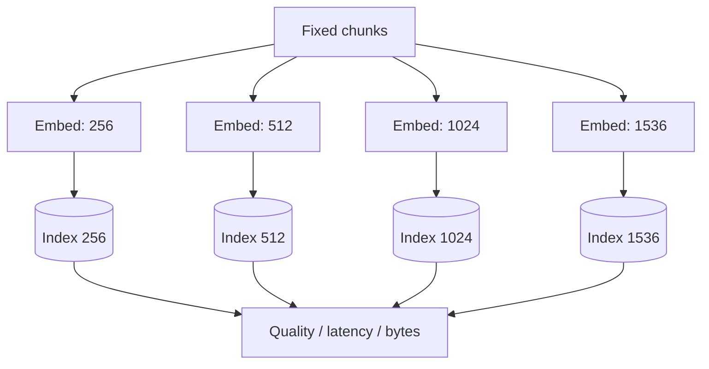
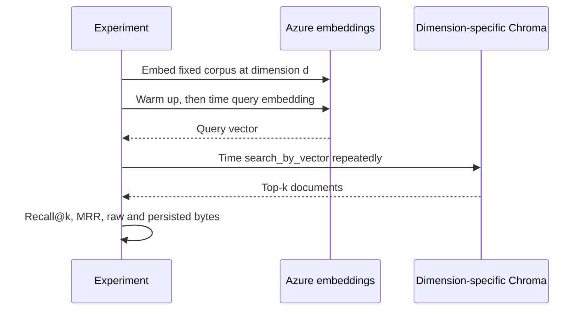

# Lab 2 — Vector Dimensions

For Python syntax and the shared setup, read [Start Here](../../../../docs/START_HERE.md).
The adjacent Python implementation includes docstrings and inline comments explaining the steps.

Use this controlled experiment to understand whether narrower embeddings preserve retrieval quality
while reducing vector memory and index size. It changes dimensions and holds corpus, chunks, model,
distance metric, questions, and top-k fixed.





## Run it

```bash
uv run rag-lab compare-dimensions --dimensions 256,512,1024,1536 --repetitions 5
```

The command exports `dimension-results.json`, `dimension-results.csv`, and
`dimension-comparison.png` under `artifacts/dimensions/`. Each dimension has an isolated collection
and manifest. Query embedding and vector search are timed separately after a warmup.

Only the 25 supported standalone questions are included; ambiguous follow-ups require history
and are reserved for conversational evaluation. Each result records `index_created` and separates
`document_embedding_ms`, `index_build_ms`, and `index_load_ms`. A newly created index has no load
timing; a reused index has no embedding/build timing (JSON `null`, empty CSV cells). Build time
includes Chroma setup, vector insertion, and manifest writing, excluding measured document-embedding
calls. Use `--rebuild` for a consistently cold comparison and compare only like timing fields.

Worked trace: the PAY-2031 question is embedded at each width and searched only against an index
created at that same width. The expected document is `04_payments`; its presence contributes to
recall and its first position determines reciprocal rank.

The default model is `text-embedding-3-small`, whose maximum is 1536. For a separate
`text-embedding-3-large` deployment, set the model/deployment variables and test up to 3072. Do not
mix those rows with the small-model conclusion because both model and width changed. Lower output
dimensions do not necessarily lower API charges. This tiny corpus cannot predict production
latency or HNSW behavior; repeat with realistic scale.


## Exercises

1. Tune: repeat with top-k 1 and 8; explain why dimension sensitivity changes.
2. Break: deliberately open a 512-dimensional collection with 256-dimensional embeddings and inspect the guardrail.
3. Extend: run the large model separately and plot quality against estimated cost and storage.
